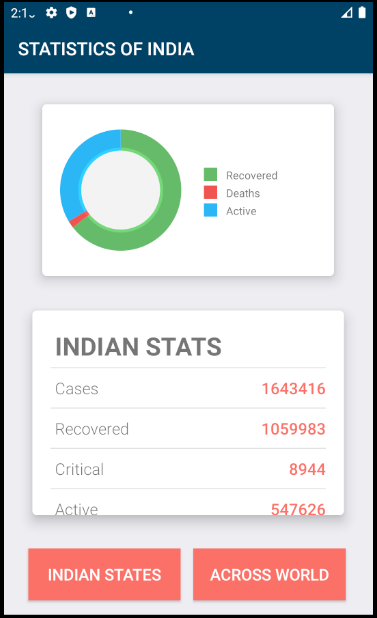

# CovidoMeter
Developed an Android Application which tell you the statistics of COVID-19 about any Country and any states Using REST API &amp; Volley in Android Studio using Java, July 2020.

# This is Screenshots of Statistics of India.

 

# This is Screenshots of Statistics of World.

 

